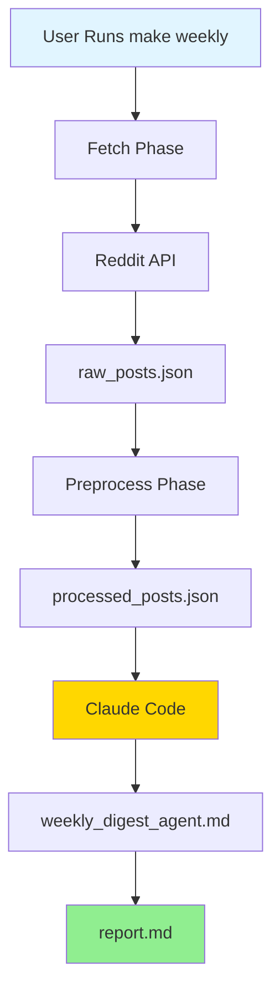
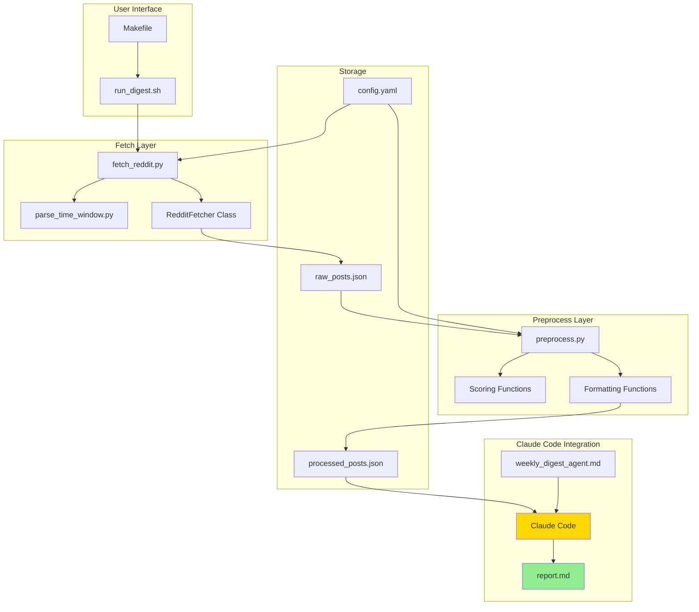
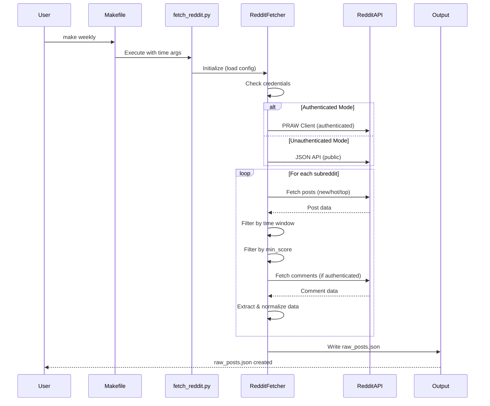
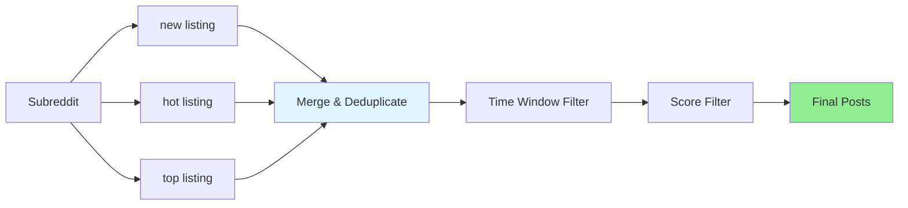
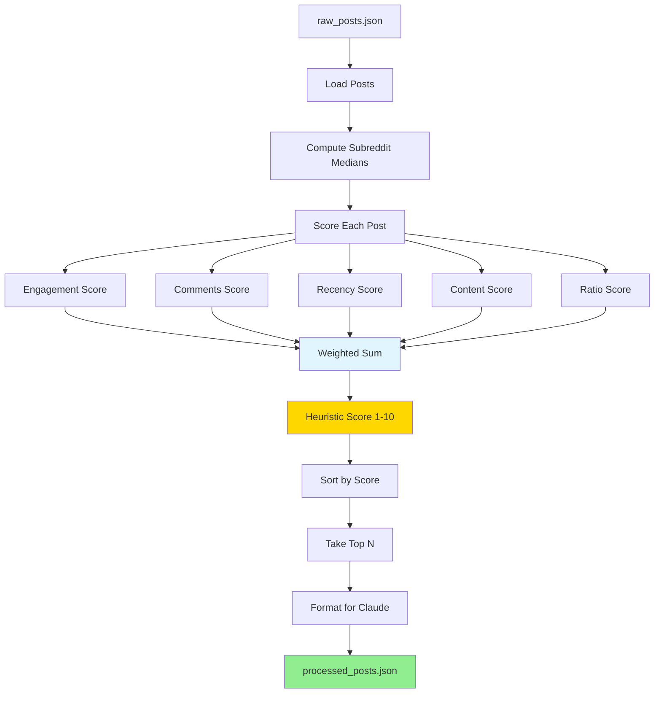
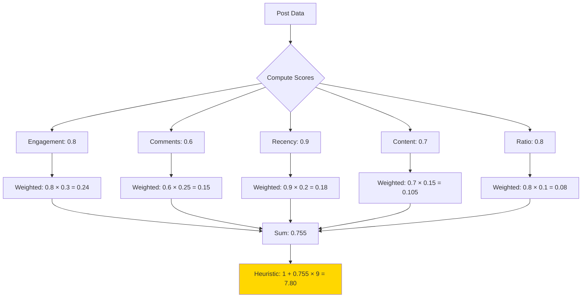
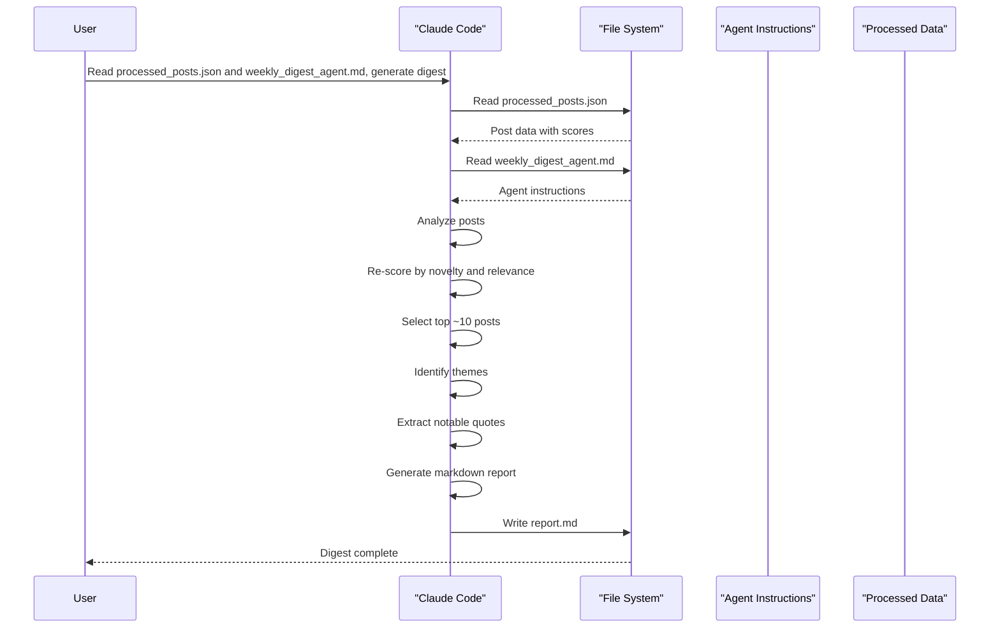
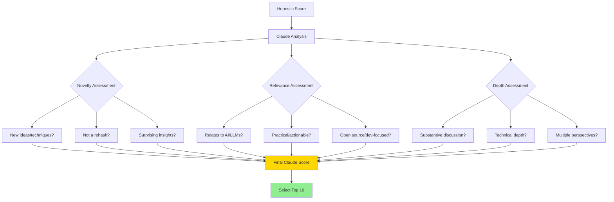
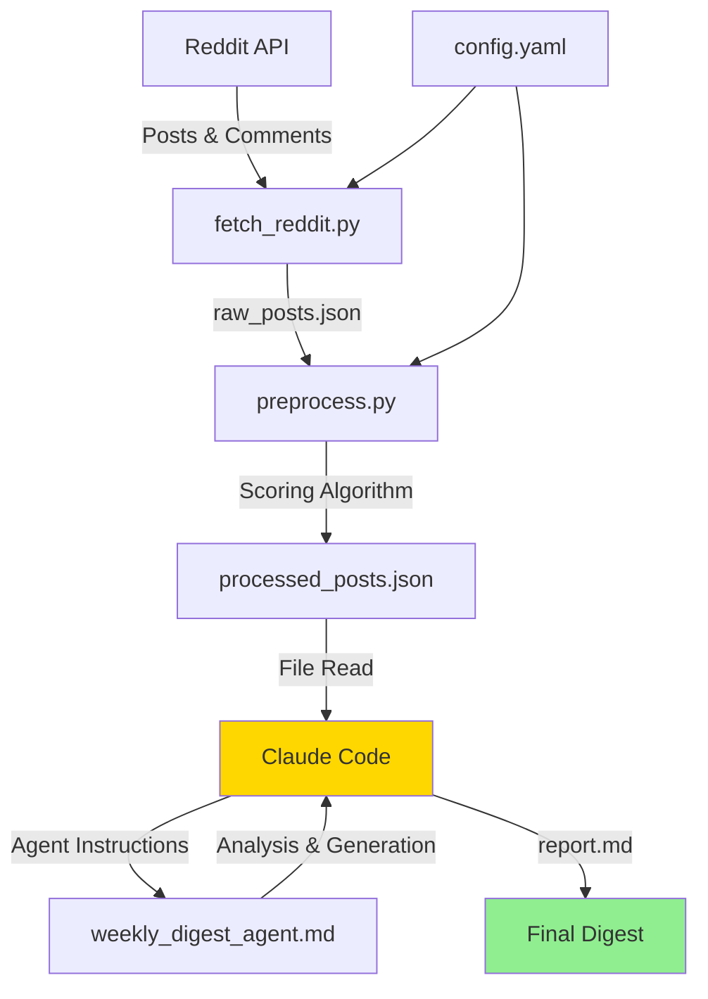

# Technical Documentation: AI Reddit Digest System

This document provides a detailed technical overview of the AI Reddit Digest system, including architecture, data flow, and integration with Claude Code.

## Table of Contents

1. [System Overview](#system-overview)
2. [Architecture](#architecture)
3. [Fetch Phase](#fetch-phase)
4. [Preprocess Phase](#preprocess-phase)
5. [Digest Phase](#digest-phase)
6. [Claude Code Integration](#claude-code-integration)
7. [Data Structures](#data-structures)
8. [Configuration](#configuration)

---

## System Overview

The AI Reddit Digest system is a three-phase pipeline that collects, processes, and summarizes AI-related Reddit discussions:

1. **Fetch**: Retrieves posts and comments from Reddit subreddits
2. **Preprocess**: Scores and filters posts using heuristic algorithms
3. **Digest**: Uses Claude Code to generate personalized summaries

The system is designed to be **local-first** and **Claude Code-native**, meaning it leverages Claude Code's file reading and generation capabilities rather than requiring separate API integrations.

### High-Level Flow



---

## Architecture

### Component Diagram



### System Components

| Component | Purpose | Technology |
|-----------|---------|------------|
| `fetch_reddit.py` | Reddit data collection | Python, PRAW, Requests |
| `preprocess.py` | Scoring and filtering | Python, Statistics |
| `parse_time_window.py` | Time window utilities | Python, dateutil |
| `weekly_digest_agent.md` | Claude Code instructions | Markdown |
| `config.yaml` | System configuration | YAML |
| `Makefile` | Build automation | Make |

---

## Fetch Phase

The fetch phase retrieves Reddit posts and comments from specified subreddits within a time window.

### Fetch Process Flow



### Fetch Phase Details

#### 1. Initialization (`RedditFetcher.__init__`)

- Loads configuration from `config.yaml`
- Attempts to initialize PRAW client with credentials
- Falls back to unauthenticated JSON API if credentials unavailable
- Configures rate limiting and fetch limits

#### 2. Authentication Modes

**Authenticated Mode (PRAW):**
- Requires `client_id` and `client_secret` in config
- Better rate limits (60 requests/minute)
- Can fetch full comment trees
- More reliable data access

**Unauthenticated Mode:**
- No credentials required
- Rate limited (30 requests/minute)
- Limited comment access
- Uses Reddit's public JSON API

#### 3. Data Collection Strategy

The fetcher uses a multi-listing approach to maximize coverage:



#### 4. Data Extraction

Each post is normalized to a consistent structure:

```python
{
    'id': str,
    'title': str,
    'author': str,
    'subreddit': str,
    'score': int,
    'upvote_ratio': float,
    'num_comments': int,
    'created_utc': float,
    'created_datetime': str (ISO-8601),
    'url': str,
    'permalink': str,
    'selftext': str,
    'is_self': bool,
    'link_flair_text': str,
    'comments': List[Dict]
}
```

#### 5. Rate Limiting

- Configurable delay between requests (`rate_limit_delay`, default: 2s)
- Additional delay between subreddits
- Respects Reddit API rate limits

### Output: `raw_posts.json`

```json
{
  "metadata": {
    "fetch_time": "2025-01-15T10:30:45Z",
    "start_time": "2025-01-08T10:30:45Z",
    "end_time": "2025-01-15T10:30:45Z",
    "subreddits": ["MachineLearning", "LocalLLaMA", ...],
    "total_posts": 234,
    "authenticated": true
  },
  "posts": [...]
}
```

---

## Preprocess Phase

The preprocess phase scores, filters, and formats posts for Claude Code consumption.

### Preprocess Process Flow



### Scoring Algorithm

The heuristic score combines five signals with configurable weights:

#### 1. Engagement Score (30% weight)

```python
engagement = log10(score + 1) / (log10(median_score + 1) + 2)
```

- Uses logarithmic scaling to prevent viral posts from dominating
- Normalized against subreddit median for fairness
- Range: 0.0 to 1.0

#### 2. Comments Score (25% weight)

```python
comments = min(1.0, log10(num_comments + 1) / 3)
```

- Diminishing returns: 10 comments ≈ 0.5, 100 ≈ 0.75, 1000 ≈ 0.9
- High comment counts indicate discussion-worthy content

#### 3. Recency Score (20% weight)

```python
recency = (post_time - start_time) / (end_time - start_time)
```

- Fresher content within the time window scores higher
- Helps surface recent developments

#### 4. Content Score (15% weight)

- Very short (< 50 chars): 0.3
- Brief (50-200 chars): 0.5
- Good length (200-1000 chars): 0.8
- Substantial (1000-3000 chars): 1.0
- Wall of text (> 3000 chars): 0.7

#### 5. Ratio Score (10% weight)

```python
ratio = max(0.0, (upvote_ratio - 0.5) * 2)
```

- Transforms 50% → 0, 75% → 0.5, 100% → 1.0
- High upvote ratios indicate community approval

#### Final Heuristic Score

```python
heuristic_score = 1 + (weighted_sum * 9)
```

- Scales weighted sum (0-1) to 1-10 range
- Rounded to 2 decimal places

### Scoring Visualization



### Data Formatting

Before writing to `processed_posts.json`, posts are formatted for Claude:

1. **Text Truncation**: `selftext` limited to 500 chars
2. **Comment Selection**: Top 5 comments by score
3. **Comment Truncation**: Comment bodies limited to 300 chars
4. **Field Selection**: Only relevant fields included

### Output: `processed_posts.json`

```json
{
  "metadata": {
    "fetch_time": "...",
    "start_time": "...",
    "end_time": "...",
    "preprocessed_at": "2025-01-15T10:31:12Z",
    "subreddits": [...],
    "total_posts": 234
  },
  "posts": [
    {
      "id": "...",
      "title": "...",
      "subreddit": "MachineLearning",
      "author": "...",
      "score": 1234,
      "num_comments": 89,
      "upvote_ratio": 0.95,
      "created_datetime": "2025-01-14T15:30:00Z",
      "permalink": "https://reddit.com/...",
      "selftext": "...",
      "heuristic_score": 8.45,
      "top_comments": [...]
    }
  ],
  "preprocessing": {
    "input_count": 234,
    "output_count": 50,
    "filtered_count": 184,
    "subreddit_medians": {...}
  }
}
```

---

## Digest Phase

The digest phase uses Claude Code to generate personalized summaries from preprocessed data.

### Digest Process Flow



### Claude Code Integration

Claude Code operates as an **intelligent file processor** in this system:

1. **File Reading**: Claude Code reads `processed_posts.json` and `agents/weekly_digest_agent.md`
2. **Context Understanding**: Understands the data structure and agent instructions
3. **Intelligent Processing**: 
   - Re-scores posts based on novelty and personal relevance
   - Identifies emerging themes across posts
   - Extracts insightful quotes from comments
4. **Report Generation**: Creates a well-formatted Markdown report

### Agent Instructions (`weekly_digest_agent.md`)

The agent instructions define:

- **Scoring Criteria**: How to re-score posts (novelty 30%, relevance 30%, engagement 25%, depth 15%)
- **User Interests**: Topics to prioritize (LLMs, AI agents, open source tools, etc.)
- **Output Format**: Exact Markdown structure for the report
- **Guidelines**: Be concise, specific, balanced, practical, honest

### Re-Scoring Process

Claude Code performs a second scoring pass that considers:



### Report Structure

The generated report includes:

1. **Header**: Coverage dates and generation timestamp
2. **Top Discussions**: ~10 posts with summaries and key insights
3. **Emerging Themes**: Patterns and trends observed
4. **Notable Quotes**: Insightful comments highlighted
5. **Personal Take**: Synthesis and analysis
6. **Footer**: Statistics about the digest

### Output: `report.md`

A well-formatted Markdown document ready for reading or sharing.

---

## Claude Code Integration

### How Claude Code Fits In

Claude Code is not called via API—instead, it's used interactively to:

1. **Read Files**: Access `processed_posts.json` and agent instructions
2. **Process Data**: Analyze and score posts intelligently
3. **Generate Output**: Create the final digest report

### Workflow with Claude Code

```mermaid
graph LR
    A[User] -->|"make weekly"| B[Python Scripts]
    B --> C[processed_posts.json]
    C --> D[User asks Claude Code]
    D -->|"Read processed_posts.json<br/>and agent instructions"| E[Claude Code]
    E -->|Analyzes| F[Generates report.md]
    F --> G[User reads digest]
    
    style D fill:#e1f5ff
    style E fill:#ffd700
    style F fill:#90ee90
```



### Advantages of Claude Code Integration

1. **No API Keys**: Works directly with Claude Code's file reading capabilities
2. **Interactive Refinement**: User can ask for adjustments or clarifications
3. **Context Awareness**: Claude Code understands the project structure
4. **Flexible Output**: Can generate different formats or styles on demand
5. **Local-First**: All data stays local, no external API calls

### Example Claude Code Interaction

```
User: Read output/latest/processed_posts.json and agents/weekly_digest_agent.md, 
      then generate the digest report and save it to output/latest/report.md

Claude Code: 
  1. Reads processed_posts.json (50 posts with scores)
  2. Reads weekly_digest_agent.md (instructions)
  3. Analyzes posts, re-scores by novelty/relevance
  4. Selects top 10 most interesting posts
  5. Identifies themes and extracts quotes
  6. Generates markdown report
  7. Saves to output/latest/report.md
```

---

## Data Structures

### Raw Post Structure

```typescript
interface RawPost {
  id: string;
  title: string;
  author: string;
  subreddit: string;
  score: number;
  upvote_ratio: number;
  num_comments: number;
  created_utc: number;
  created_datetime: string; // ISO-8601
  url: string;
  permalink: string;
  selftext: string;
  is_self: boolean;
  link_flair_text: string;
  comments: Comment[];
}

interface Comment {
  id: string;
  author: string;
  body: string;
  score: number;
  created_utc: number;
}
```

### Processed Post Structure

```typescript
interface ProcessedPost {
  id: string;
  title: string;
  subreddit: string;
  author: string;
  score: number;
  num_comments: number;
  upvote_ratio: number;
  created_datetime: string;
  permalink: string;
  selftext: string; // Truncated to 500 chars
  heuristic_score: number; // 1-10
  top_comments: TopComment[]; // Top 5 by score
}

interface TopComment {
  author: string;
  score: number;
  body: string; // Truncated to 300 chars
}
```

### Metadata Structure

```typescript
interface Metadata {
  fetch_time: string; // ISO-8601
  start_time: string; // ISO-8601
  end_time: string; // ISO-8601
  preprocessed_at?: string; // ISO-8601
  subreddits: string[];
  total_posts: number;
  authenticated: boolean;
}
```

---

## Configuration

### Configuration File (`config.yaml`)

The system is configured via `config.yaml`:

```yaml
# Reddit API credentials (optional)
reddit:
  client_id: ""
  client_secret: ""
  user_agent: "AI-Reddit-Digest/1.0"

# Subreddits to monitor
subreddits:
  - MachineLearning
  - LocalLLaMA
  - ChatGPT
  - ClaudeAI
  - OpenAI

# Time window defaults
time_window:
  start: ""
  end: ""
  default_days: 7

# Fetch settings
fetch:
  max_posts_per_subreddit: 50
  max_comments_per_post: 20
  min_score: 5
  rate_limit_delay: 2

# Scoring weights
scoring:
  engagement_weight: 0.3
  comments_weight: 0.25
  novelty_weight: 0.25
  relevance_weight: 0.2

# User interests (for Claude scoring)
interests:
  - Large Language Models
  - AI agents
  - Open source AI tools
```

### Configuration Priority

1. **CLI Arguments**: Highest priority (e.g., `--start`, `--end`, `--subreddit`)
2. **Config File**: Medium priority (defaults and preferences)
3. **Hardcoded Defaults**: Lowest priority (fallback values)

---

## Data Flow Summary



---

## Performance Considerations

### Fetch Phase
- **Rate Limiting**: 2s delay between requests (configurable)
- **Parallelization**: Sequential subreddit fetching (Reddit API limits)
- **Time Complexity**: O(n × m) where n = subreddits, m = posts per subreddit

### Preprocess Phase
- **Scoring**: O(n) where n = number of posts
- **Sorting**: O(n log n) for top-N selection
- **Memory**: Stores all posts in memory (typically < 10MB for 200 posts)

### Digest Phase
- **Claude Code**: Processing time depends on number of posts and complexity
- **Token Usage**: ~500-2000 tokens per post analyzed
- **Output Size**: Typically 5-15KB for final report

---

## Error Handling

### Fetch Phase Errors
- **API Failures**: Logged, continues with other subreddits
- **Authentication Failures**: Falls back to unauthenticated mode
- **Rate Limit Exceeded**: Automatic retry with backoff

### Preprocess Phase Errors
- **Missing Fields**: Uses defaults or skips invalid posts
- **Invalid JSON**: Exits with error message
- **Config Errors**: Uses hardcoded defaults

### Digest Phase Errors
- **File Not Found**: Claude Code will report the error
- **Invalid Data**: Claude Code can handle gracefully or request clarification

---

## Future Enhancements

Potential improvements to the system:

1. **Caching**: Cache Reddit data to avoid redundant fetches
2. **Incremental Updates**: Only fetch new posts since last run
3. **Database Storage**: Store historical data for trend analysis
4. **Web Interface**: Browser-based UI for viewing digests
5. **Email Delivery**: Automated email digests
6. **Multi-User Support**: Personalization per user
7. **Advanced Scoring**: Machine learning-based relevance scoring
8. **Comment Threading**: Better comment tree visualization

---

## Conclusion

The AI Reddit Digest system demonstrates a **local-first, Claude Code-native** approach to content curation. By leveraging Claude Code's file reading and generation capabilities, the system avoids the complexity of API integrations while maintaining flexibility and intelligence in the summarization process.

The three-phase architecture (Fetch → Preprocess → Digest) provides clear separation of concerns, making the system maintainable and extensible.


